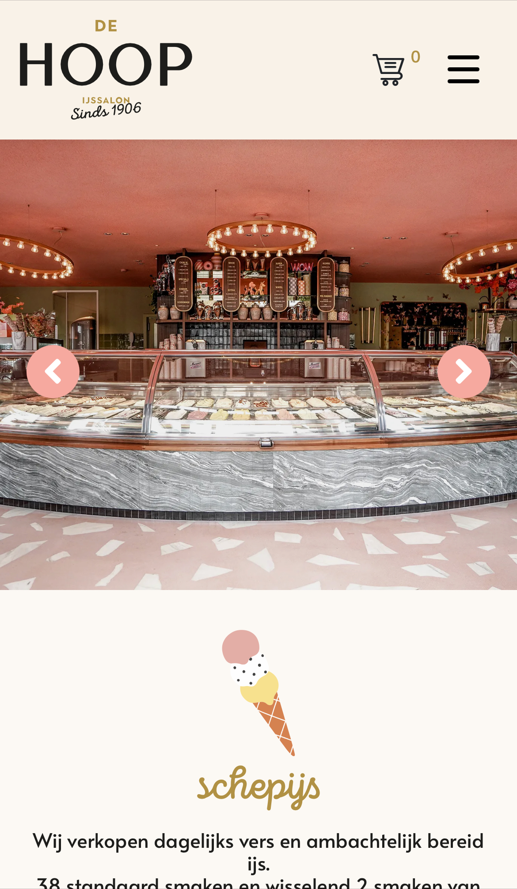
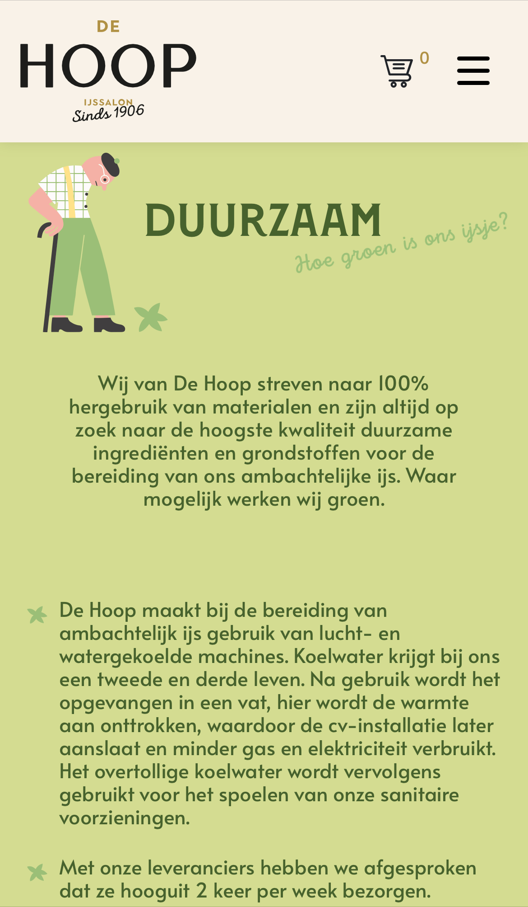
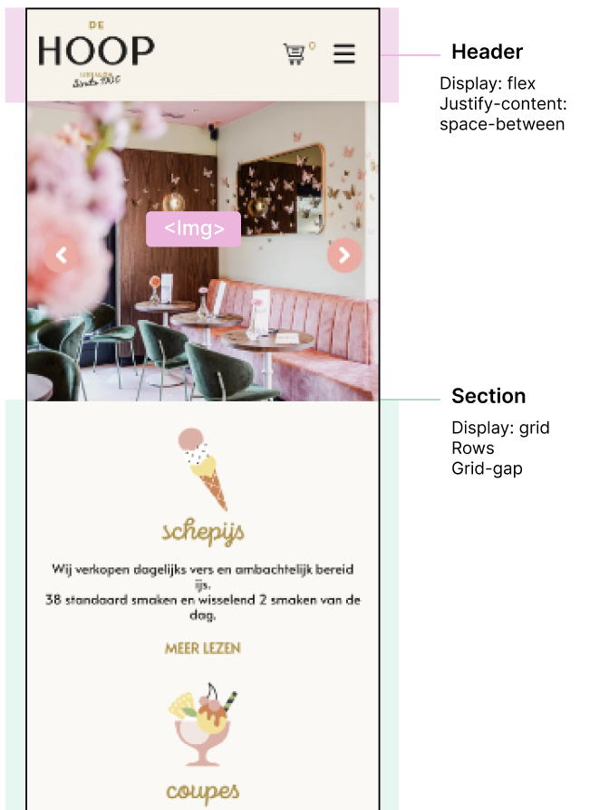
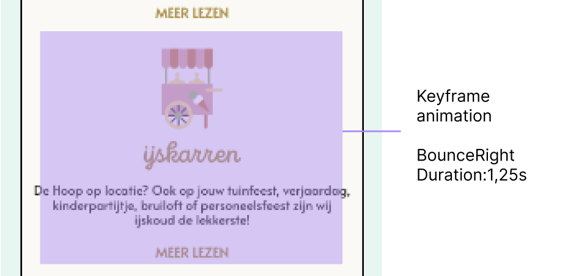
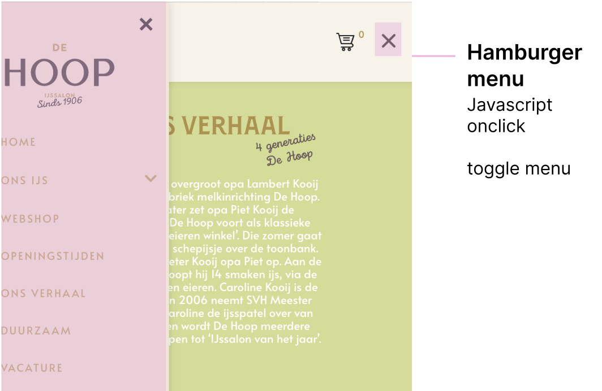
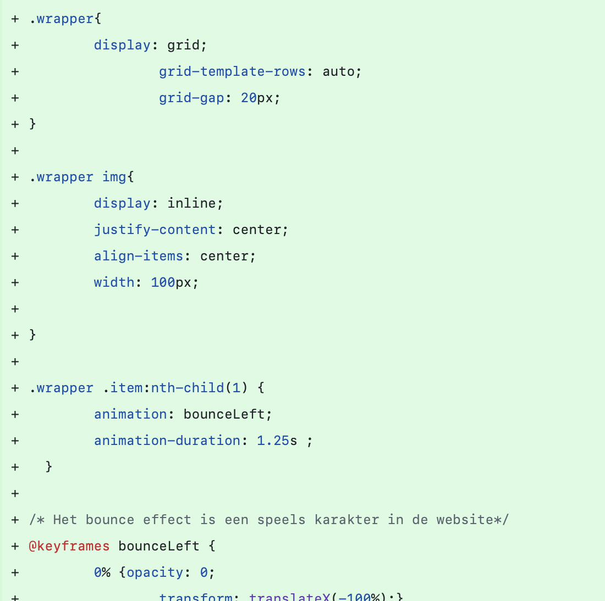
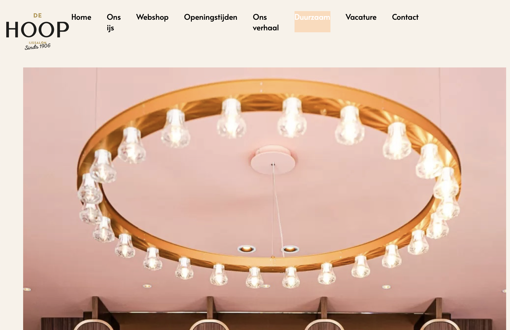
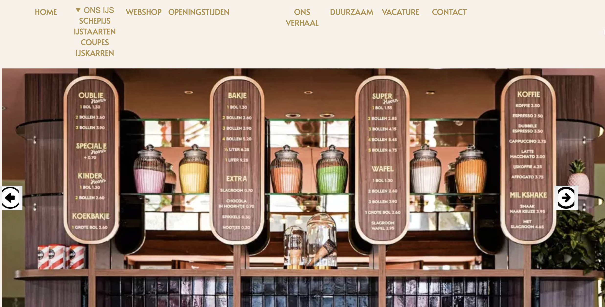

# Procesverslag
Markdown is een simpele manier om HTML te schrijven.  
Markdown cheat cheet: [Hulp bij het schrijven van Markdown](https://github.com/adam-p/markdown-here/wiki/Markdown-Cheatsheet).

Nb. De standaardstructuur en de spartaanse opmaak van de README.md zijn helemaal prima. Het gaat om de inhoud van je procesverslag. Besteedt de tijd voor pracht en praal aan je website.

Nb. Door *open* toe te voegen aan een *details* element kun je deze standaard open zetten. Fijn om dat steeds voor de relevante stuk(ken) te doen.

## Jij

  
uitwerken voor kick-off werkgroep

  ### Auteur:
  Iris Heemskerk

  #### Je startniveau:
 Rood

  #### Je focus:
  Surface laag, animaties
 

## Je website

  
uitwerken voor kick-off werkgroep

  ### Je opdracht:
  link naar de website die je gaat namaken of de naam/omschrijving van je eigen ontwerp

  #### Screenshot(s) van de eerste pagina (small screen): 
  Home pagina
  

  #### Screenshot(s) van de tweede pagina (small screen):
  Duurzaam pagina  
  
 

## Toegankelijkheidstest 1/2 (week 1)

  
uitwerken na test in 2e werkgroep

  ### Bevindingen
  Lijst met je bevindingen die in de test naar voren kwamen:

  Voiceover

  -Duidelijke omschrijving van de website bij de voiceover.
  -Bij links werden verteld dat deze klikbaar waren.
  -Er is een optie om links te skippen en meteen naar de content van de website te gaan.
  -Er is een draaiknop waarmee je makkelijk naar 1 deel van de website kan springen.
  -Best wel wat waarschuwingen in de website.

  

## Breakdownschets (week 1)

  
uitwerken na afloop 3e werkgroep

  Hier heb ik gekeken naar hoe de website is opgebouwd en hoe ik dit eventueel met code in elkaar kan zetten.

  ### de hele pagina: 
  

  ### dynamisch deel (bijv menu): 
  

  ### wellicht nog een dynamisch deel (bijv filter): 
  

## Voortgang 1 (week 2)

  
uitwerken voor 1e voortgang

  ### Stand van zaken
  hier dit ging goed & dit was lastig (neem ook screenshots op van delen van je website en code)

   
   
    

  

Wat ik wou verbeteren is dat elementen in het midden gingen staan binnen de grid, een beeld hebben voor de grote navigatie en feedback over mijn html tot nu toe.

  ### Agenda voor meeting
  samen met je groepje opstellen

  | student 1      | student 2          | student 3    | student 4        |
  | ---            | ---                | ---          | ---              |
  | dit bespreken  | en dit             | en ik dit    | en dan ik dat    |
  | en dat ook nog | dit als er tijd is | nog een punt | dit wil ik zeker |
  | ...            | ...                | ...          | ...              |

  ### Verslag van meeting
  hier na afloop snel de uitkomsten van de meeting vastleggen

 Dit heb ik geleerd:

- Waar een z-index voor wordt gebruikt.
- Dat ik beter een flexbox kan gebruiken ipv grid voor mijn website onderdeel.
- Dat ik nog het favicon van de website moet overnemen.
- Dat ik alles even in sections + articles moet neerzetten.
- Dat ik een nieuwe nav moet maken voor grotere schaal.
- Dat ik doormiddel van details een dropdown kan maken.
- Dat ik beter met margin-bottom kan werken ipv span toe te voegen in de html.
- Dat inline style elementen weggehaald moeten worden.

## Voortgang 2 (week 3)

  
uitwerken voor 2e voortgang

  ### Stand van zaken
  hier dit ging goed & dit was lastig (neem ook screenshots op van delen van je website en code)

Ik wil mijn header verbeteren en mijn hamburgermenu van kleur laten veranderen ook moet ik nog een deel van de homepagina responsive maken.
  ### Agenda voor meeting
  samen met je groepje opstellen

  | student 1      | student 2          | student 3    | student 4        |
  | ---            | ---                | ---          | ---              |
  | dit bespreken  | en dit             | en ik dit    | en dan ik dat    |
  | en dat ook nog | dit als er tijd is | nog een punt | dit wil ik zeker |
  | ...            | ...                | ...          | ...              |

  ### Verslag van meeting
  hier na afloop snel de uitkomsten van de meeting vastleggen

  - punt 1
  - punt 2
  - nog een punt
- ...

## Toegankelijkheidstest 2/2 (week 4)

  
uitwerken na test in 9e werkgroep

  ### Bevindingen
  Lijst met je bevindingen die in de test naar voren kwamen (geef ook aan wat er verbeterd is):

## Voortgang 3 (week 4)

  
uitwerken voor 3e voortgang

  ### Stand van zaken
  hier dit ging goed & dit was lastig (neem ook screenshots op van delen van je website en code)

  ### Agenda voor meeting
  samen met je groepje opstellen

  | student 1      | student 2          | student 3    | student 4        |
  | ---            | ---                | ---          | ---              |
  | dit bespreken  | en dit             | en ik dit    | en dan ik dat    |
  | en dat ook nog | dit als er tijd is | nog een punt | dit wil ik zeker |
  | ...            | ...                | ...          | ...              |

  ### Verslag van meeting
  hier na afloop snel de uitkomsten van de meeting vastleggen

  - punt 1
  - punt 2
  - nog een punt
  - ...

## Eindgesprek (week 5)

  
uitwerken voor eindgesprek

  ### Je uitkomst - karakteristiek screenshots:
  

  ### Dit ging goed/Heb ik geleerd: 
  Korte omschrijving met plaatjes

  

  ### Dit was lastig/Is niet gelukt:
  Korte omschrijving met plaatjes

  

## Bronnenlijst

  
continu bijhouden terwijl je werkt

  Nb. Wees specifiek ('css-tricks' als bron is bijv. niet specifiek genoeg). 
  Nb. ChatGpT en andere AI horen er ook bij.
  Nb. Vermeld de bronnen ook in je code.

  1. bron 1
  2. bron 2
  3. ...

