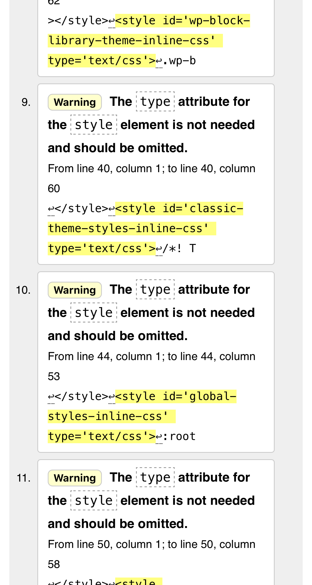
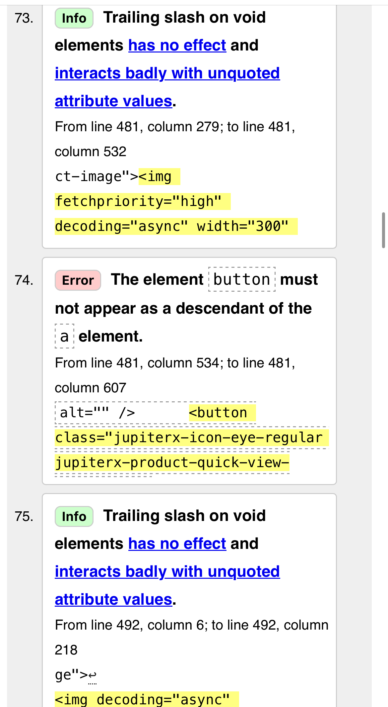
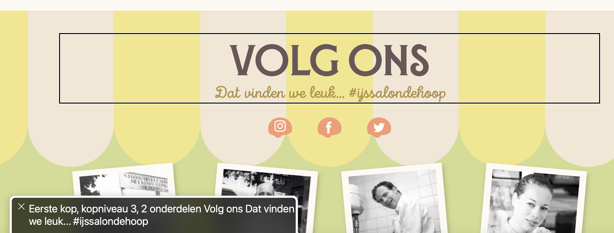
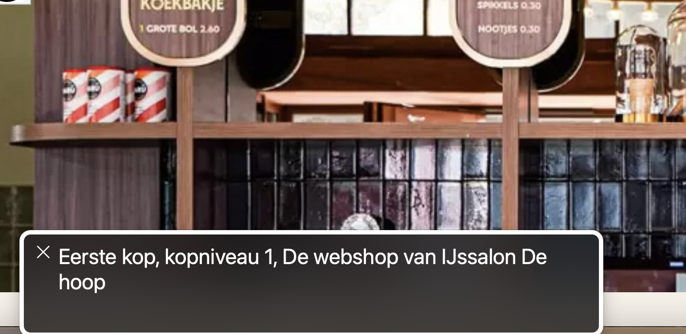
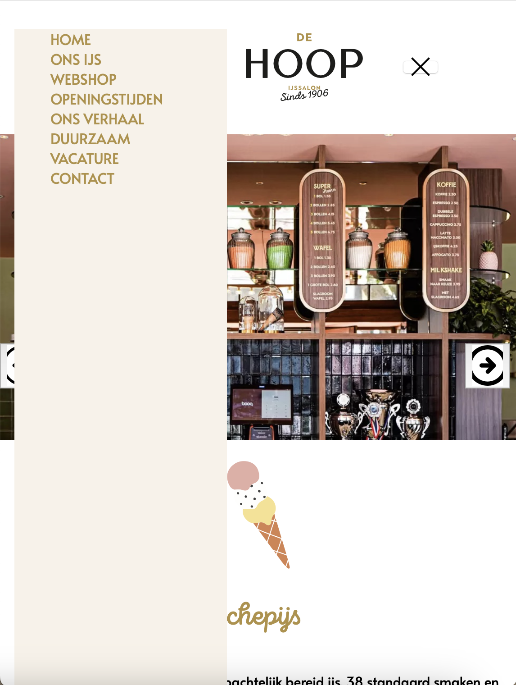
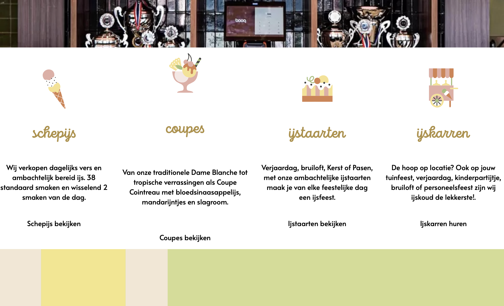
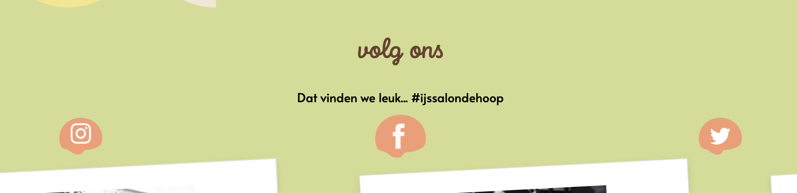
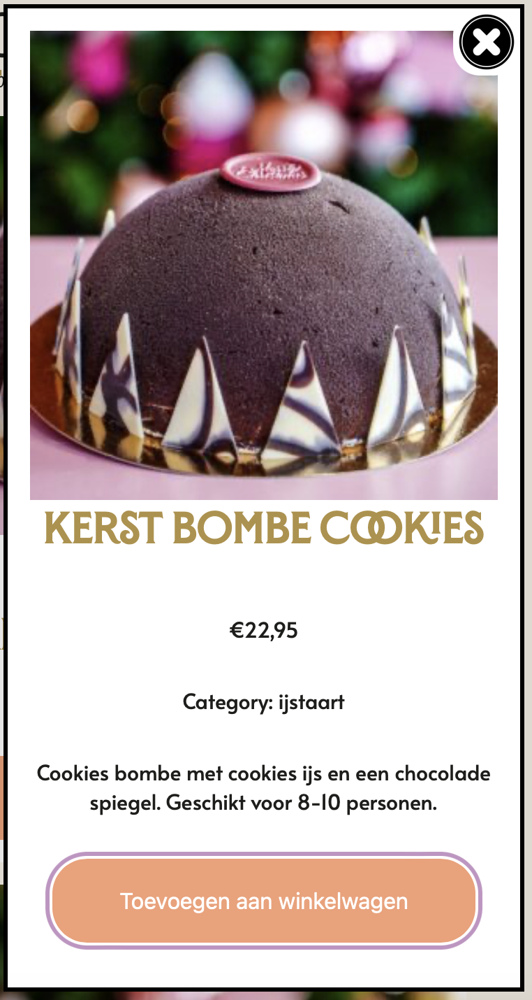

# Procesverslag
Markdown is een simpele manier om HTML te schrijven.  
Markdown cheat cheet: [Hulp bij het schrijven van Markdown](https://github.com/adam-p/markdown-here/wiki/Markdown-Cheatsheet).

Nb. De standaardstructuur en de spartaanse opmaak van de README.md zijn helemaal prima. Het gaat om de inhoud van je procesverslag. Besteedt de tijd voor pracht en praal aan je website.

Nb. Door *open* toe te voegen aan een *details* element kun je deze standaard open zetten. Fijn om dat steeds voor de relevante stuk(ken) te doen.

## Jij

  
uitwerken voor kick-off werkgroep

  ### Auteur:
  Iris Heemskerk

  #### Je startniveau:
 Rood

  #### Je focus:
  Responsive
 

## Je website

  
uitwerken voor kick-off werkgroep

  ### Je opdracht:
  link naar de website die je gaat namaken of de naam/omschrijving van je eigen ontwerp

  #### Screenshot(s) van de eerste pagina (small screen): 
  Home pagina
  

  #### Screenshot(s) van de tweede pagina (small screen):
  Duurzaam pagina  
  
 

## Toegankelijkheidstest 1/2 (week 1)

  
uitwerken na test in 2e werkgroep

  ### Bevindingen
  Lijst met je bevindingen die in de test naar voren kwamen:

Ik kan de links in de website overslaan door skip links, nog niet alles wordt goed beschreven zo hoor ik op de voiceover afbeelding2550 maar niet wat er op de afbeelding wordt weergegeven.

Ik kan de voiceover met pijltjes besturen en de control, option command met een pijltje gebruiken om te springen naar links of headings in de website.

  -Duidelijke omschrijving van de website bij de voiceover.
  -Bij links werden verteld dat deze klikbaar waren.
  -Er is een optie om links te skippen en meteen naar de content van de website te gaan.
  -Er is een draaiknop waarmee je makkelijk naar 1 deel van de website kan springen.
  -Best wel wat waarschuwingen in de website.

De website heeft in de validator best nog wel wat errors en waarschuwingen, dit komt omdat er inline style elementen worden gebruikt en ook omdat er sommige elementen niet goed worden genest.

  

## Breakdownschets (week 1)

  
uitwerken na afloop 3e werkgroep

  Hier heb ik gekeken naar hoe de website is opgebouwd en hoe ik dit eventueel met code in elkaar kan zetten.

  ### de hele pagina: 
  

  ### dynamisch deel (bijv menu): 
  

  ### wellicht nog een dynamisch deel (bijv filter): 
  

## Voortgang 1 (week 2)

  
uitwerken voor 1e voortgang

  ### Stand van zaken
  hier dit ging goed & dit was lastig (neem ook screenshots op van delen van je website en code)

   
   
    

  

Wat ik wou verbeteren is dat elementen in het midden gingen staan binnen de grid, een beeld hebben voor de grote navigatie en feedback over mijn html tot nu toe.

  ### Agenda voor meeting
  samen met je groepje opstellen

  Joost: vragen over tekst over een foto laten lopen, px en em verhouding
  Luna: Align items en justify items en elementen selecteren
  Iris: Binnen een grid afbeeldingen centreren

  ### Verslag van meeting
  hier na afloop snel de uitkomsten van de meeting vastleggen

 Dit heb ik geleerd:

- Waar een z-index voor wordt gebruikt.
- Dat ik beter een flexbox kan gebruiken ipv grid voor mijn website onderdeel.
- Dat ik nog het favicon van de website moet overnemen.
- Dat ik alles even in sections + articles moet neerzetten.
- Dat ik een nieuwe nav moet maken voor grotere schaal.
- Dat ik doormiddel van details een dropdown kan maken.
- Dat ik beter met margin-bottom kan werken ipv span toe te voegen in de html.
- Dat inline style elementen weggehaald moeten worden.

## Voortgang 2 (week 3)

  
uitwerken voor 2e voortgang

  ### Stand van zaken
  hier dit ging goed & dit was lastig (neem ook screenshots op van delen van je website en code)

Ik wil mijn header verbeteren en mijn hamburgermenu van kleur laten veranderen ook moet ik nog een deel van de homepagina responsive maken.

  ### Agenda voor meeting
  samen met je groepje opstellen

  Luna: Vragen over animatie, grid en responsive footer
  Alycia: zoekbalk verplaatsen en grid
  Iris: Dropdown vragen en hamburgermenu kleur vragen

  ### Verslag van meeting
  hier na afloop snel de uitkomsten van de meeting vastleggen

  - Hoe grid werkt in een menu
  - Hoe ik items in het hamburgermenu kan positioneren
  - Hoe ik een dark en lightmode mooi kan verwerken

## Toegankelijkheidstest 2/2 (week 4)

  
uitwerken na test in 9e werkgroep

  ### Bevindingen
  Lijst met je bevindingen die in de test naar voren kwamen:

De Hoop website:

De eerste kop op de home pagina is een h3 dit is van het stukje volg ons, de heading volgorde is dus niet goed op deze website.

Het is niet duidelijk waar een link je naartoe brengt.

Mijn website:

Bij mijn website werd eerst de H1 niet voorgelezen omdat hij ook voor de schermlezer was verstopt, door de class visually hidden toe te voegen werd hij wel gewoon voorgelezen.

Alle afbeeldingen op de website waren ook duidelijk omschreven en de aria labels zorgt voor een goede omschrijving van de links.

De tekst van een link bij De Hoop website geeft maar weinig informatie, er staat alleen "lees meer" en niet naar welke pagina je kan gaan.

  Verbeteringen:

-Logische heading volgorde, de website heeft in de header een h1 en daarna per sectie weer een h2.
  -Ik heb de tekstomschrijving veranderd ipv lees meer bijvoorbeeld ijskarren huren, dan weet de gebruiker wat deze kan verwachten.
  -Geen foutmeldingen in de website.
  -Goed leesbare tekst voor iedereen.
  -De website heeft nu een darkmode wat fijn is voor de gebruiker.
  -Ik heb aria-labels toegevoegd zodat links duidelijker zijn.
  -De h1 heeft nu een class waardoor deze niet te zien is maar wel door de schermlezer wordt voorgelezen.

   

## Voortgang 3 (week 4)

  
uitwerken voor 3e voortgang

  ### Stand van zaken
  hier dit ging goed & dit was lastig (neem ook screenshots op van delen van je website en code)

  Ik heb een pop-up toegevoegd aan mijn webshop pagina, ik heb dit nog nooit eerder toegepast dus ik heb een video gevolgd om deze toe te voegen.
Ik moet de pop-up wel nog goed stylen voor een computer formaat.
  

  ### Agenda voor meeting
  samen met je groepje opstellen

Luna: thema slideshow vraag
Joost: svg path maken en stop en start knop van een video
  Iris: Hoe kan ik een dialog goed stylen?

  ### Verslag van meeting
  hier na afloop snel de uitkomsten van de meeting vastleggen

  - Hamburgermenu weer zichtbaar.
  - Lettertypes goed overgenomen in de website, het werkt nu ook buiten VScode.
  - Ik zou een div kunnen toevoegen voor het kruisje binnen de dialog.

## Eindgesprek (week 5)

  
uitwerken voor eindgesprek

  ### Je uitkomst - karakteristiek screenshots:
  

  ### Dit ging goed/Heb ik geleerd: 
  Korte omschrijving met plaatjes

Wat goed ging was de lay-out overnemen van De Hoop website, ook kon ik de animaties goed verwerken zoals bij de social icons en de catogorieën.
Ik ben ook erg trots dat de slider in de website zit, ik wist de basis te verwerken maar voor het JS deel heb ik hulp gekregen.

Het is ook niet perfect nagemaakt maar ik heb zeker weer nieuwe dingen geleerd en veel tijd besteed aan het coderen van deze website. De opdrachten in de les hebben mij ook goed geholpen.
  

Ik ben ook erg trots op de webshop pagina, hier heb ik met grid gewerkt om alle onderdelen mooi responsive te krijgen!

  ### Dit was lastig/Is niet gelukt:
  Ik merkte dat het positioneren van sommige onderdelen nog best moeilijk ging, zoals bij de fotolijsten die de pagina kapot maakte als ze naast elkaar moesten staan.

  Het is mij uiteindelijk wel gelukt ze netjes naast elkaar te krijgen op een groot scherm en bij kleine schermen zie je dan 1 fotolijst

  Dit was de eerste keer dat ik een hamburgermenu in een website had toegevoegd, het stylen hiervan ging daarom helaas ook lastig. Gelukkig is het gelukt met 100% vw om het hamburgermenu over de hele breedte te laten lopen.

  

  Om bij de pop-up het kruisje helemaal rechtsboven alle content te krijgen zou ik volgens de student assistenten een div moeten gebruiken, ik heb er toen voor gekozen het op een andere manier op te lossen en ben trots op de indeling van de pop-up op mobiel scherm.

  Ook bleef de pop-up heel raar onderin het scherm staan, ik heb meerdere keren geprobeerd deze weg te halen maar dit was niet gelukt.

  ### Feedback:

  Verbeter je WCAG check en vul deze aan, de h1 werd niet door de schermlezer voorgelezen ook had ik nog niet bij alle links/buttons aria labels toegevoegd waardoor alleen de tekst werd voorgelezen. Door de aanpassingen is de website ook duidelijk voor iemand die een schermlezer gebruikt.

## Bronnenlijst

  
continu bijhouden terwijl je werkt

  Nb. Wees specifiek ('css-tricks' als bron is bijv. niet specifiek genoeg). 
  Nb. ChatGpT en andere AI horen er ook bij.
  Nb. Vermeld de bronnen ook in je code.

  Mijn bronnen heb ik in mijn code verwerkt maar hier staan er nog een paar in een rijtje:

https://www.youtube.com/watch?v=br-0i3U1VCA 
https://chatgpt.com/share/6756f526-db8c-800b-9127-c53f6160927b 
https://chatgpt.com/share/67571733-48f4-800b-a028-c440eae0fb38
https://www.w3schools.com/cssref/css3_pr_animation-timing-function.php
Sanne
Helina Kim
Studentassistent

